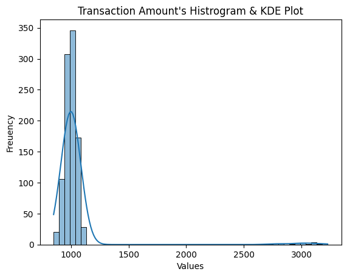

# Anomaly-Detection-in-Financial-Transactions

## Overview
Main obejctive of this project is to detect anomalies in transactions. By leveraging statistical methods and anomaly detection algorithms, one can identify fraudulent or suspicious activities in transactional data.

## Dataset
[Transactional Anomalies Dataset](https://www.kaggle.com/datasets/agitamuhammad/transactional-anomalies-dataset) consists of 1000 transactions data with 12 features.

## Methodology

### Data Preprocessing
Before performing anomaly detection, conducted data preparation and preprocessing involving examining data types and identifying any missing values. Additionally, exploratory data analysis (EDA) was carried out through visualizations to identify relevant features that contribute to detecting anomalies. By plots, one can see there are anomalies in "Trasaction_Amount" features.

### Anomaly Detection

#### (A) Statistical Methods (Z-Score, IQR)

Two statistical methods were applied to detect anomalies in the transaction data. Since the dataset's density graph does not follow a normal distribution, therefore Chebyshev's inequality 
> (mean - 2std dev)        <=   At least 75% data   <=   (mean + 2*std dev)

> (mean - 2√2*std dev)     <=   At least 87.5%      <=   (mean + 2√2*std dev)

> (mean - 3*std dev)       <=   At least 88.88%     <=   (mean + 3*std dev)

> (mean - 4*std dev)       <=   At least 93.75%     <=   (mean + 4*std dev)

> (mean - 5*std dev)       <=   At least 96%        <=   (mean + 5*std dev)

Based on data visualization and experimental analysis, a threshold of (mean+4*standard deviations) was used for anomaly detection. Using this method, a total of 20 anomalies were identified in the dataset.

On the other hand, Inter-Quantile Raneg (IQR) detected total 23 Anomalies.

#### (B) Machine Learning Agorithms (Isolation Forest, Local Outlier Factor)

Isolation Forest with 100 decision trees and 0.03 contamination detected total 30 Anomalies

Meanwhile, Local Outlier Factor with 2 n_neighbors and "auto" contamination detected 28 Anomalies.

## Detected Anomalies by All methods
Total number of transactions : 1000

Total number of Anomalies by Z-Score : 20

Total number of Anomalies by IQR : 23

Total number of Anomalies by Isolation Forest : 30

Total number of Anomalies by Local Outlier Factor: 28
